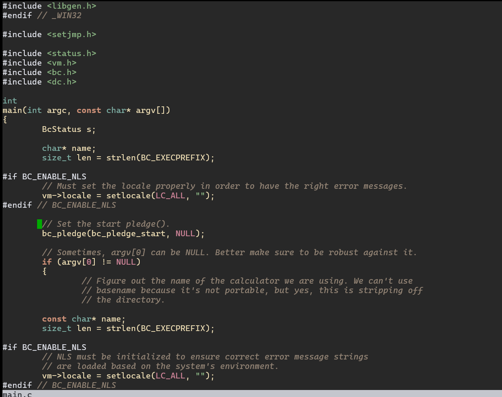

# nimmy.vim

A soft, pastel retro colorscheme for Vim and Neovim, heavily inspired by 
the warmth of **Gruvbox** but with a candy-coated twist. 

Designed specifically for low-level systems engineering (**C**, **Assembly**, **Rust**) 
and modern web development (**TypeScript**, **JavaScript**).

---

## Screenshots




> [!NOTE]
> *Nimmy looks best with a good Nerd Font (like JetBrains Mono or Fira Code).*

---

## Installation

### Using [vim-plug](https://github.com/junegunn/vim-plug)

Add this to your `init.vim` or `.vimrc`:

```vim
Plug 'NopAngel/nimmy.vim' 
```
